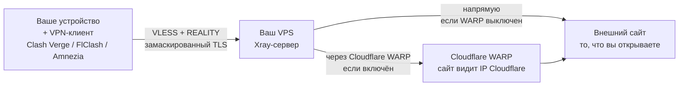

**Version:** v0.2 · **Last updated:** 2026-08-20

[](README.en.md)
[](README.md)

---

# Xray Reality VPN Server — развёртывание

> Личный VPN-сервер на своём VPS (облачном сервере) — в минимальном варианте достаточно передать в параметрах только IP и пароль root пользователя. Автоматическая настройка VLESS Xray Reality VPN + Cloudflare Warp outbound (опционально) через Ansible. Генерирует и загружает в директорию проекта готовые .json/.yaml конфиги для Amnezia / Clash Verge / FlClash — подключайтесь сразу. Благодаря персональному развёртыванию ваши данные в безопасности.

## Содержание

- [Привет](#привет)
- [Быстрый старт](#быстрый-старт)
- [Для кого это](#для-кого-это)
- [Что делает и в чём смысл](#что-делает-и-в-чём-смысл)
- [Преимущества подхода](#преимущества-подхода)
- [Где запускается](#где-запускается)
- [Требования](#требования)
- [Конфигурация](#конфигурация)
- [Клиенты](#клиенты)
- [Подробная документация](#подробная-документация)
- [Лицензия](#лицензия)
- [Автор и контакты](#автор-и-контакты)

## Привет!

Привет, это [Тим Корелов](https://github.com/lifestreamy). Делюсь своим решением для развёртывания персонального VPN, который и вы сами можете свободно и бесплатно использовать (исключительно для защиты персональных данных, естественно, и согласно всем законам). Не забудьте посмотреть правила лицензии. 

> [!TIP]
> Если хочется сразу запустить — [Быстрый старт](#быстрый-старт).

Зачем я всё это сделал? Мой сервер — мои правила. Мне захотелось иметь свой личный VPN, где:
- никто не слушает мой трафик и не логирует мои данные
- не нужно покупать сервис у кого-то, кто может завтра упасть или поменять условия
- я вижу своими глазами, что на моём сервере происходит и почему, а не доверяю на слово кому-то другому
- я могу в любой момент обновить его компоненты и кастомизировать так, как захочу, например, добавить туннель, дополнительные сервисы

Всё автоматизировал специально, чтобы можно было переиспользовать, и не настраивать руками каждый раз.

Остановился на Ansible — подробнее, почему, в блоке ниже.

<details>
  <summary>Почему Ansible (подробности для технарей)</summary>

  Ansible — зрелый инструмент автоматизации. Он идемпотентен: повторный запуск не ломает состояние, приводит сервер к нужному виду. Он расширяемый — роли и плагины уже написаны и проверены, их не нужно писать заново. Он показывает, что именно меняется на каждом шаге, и ничего не трогает, пока не попросите. Он декларативен (но позволяет добавлять и императивные части). Вся логика уже написана: я только описываю желаемое состояние сервера через готовые модули.

  Ansible запускается на вашей машине (в WSL на Windows — внутри него) и по SSH выполняет команды на сервере. На VPS он не устанавливается.

</details>

Проект не просто протестирован разово — я (и множество других людей) пользуюсь им постоянно, так как делал его в первую очередь для себя и под себя. Если что-то ломается — оно ломается и у меня, поэтому я быстро вношу правки.

Но если я что-то упустил, у вас что-то сломалось, не запускается изначально или есть пожелания — создайте новый issue.


## Быстрый старт

Минимальный случай — только IP VPS. Пароль будет скрыто запрошен интерактивно.

### Про конфигурацию

Минимально достаточно IP и пароля — всё остальное настроится само. Если нужно что-то поменять (число клиентов, WARP, порт, домен маскировки), дополнительная конфигурация производится через такие файлы:

- `inventory.yml` — подключение к VPS (создаётся из `inventory.yml.example`).
- `config/settings.yml` — параметры сервера: `num_clients`, `warp_enabled`, `xray_port`, `reality_camouflage_domain` и другие.
- `deploy.yml` — точка входа playbook.

Подробнее про каждый файл — в [`docs/SETUP.md`](docs/SETUP.md), раздел «Файлы конфигурации».

### Linux / WSL (Bash)

На Windows должен быть доступен WSL с созданным образом Ubuntu/Debian — как проверить и настроить, в [`docs/SETUP.md`](docs/SETUP.md). Если Ubuntu в WSL установлен, в меню «Пуск» будет видна иконка.

Если вы уже на Linux, то вам вряд ли нужно объяснять, как пользоваться терминалом. На Windows — найдите в поиске (Win + S) powershell или terminal.

```bash
# Только хост. Пароль спросит интерактивно (скрытый ввод).
./provision-vpn.sh -H 1.2.3.4

# С SSH-ключом.
./provision-vpn.sh -H 1.2.3.4 --pkey ~/.ssh/id_rsa

# Режим inventory: используется предзаполненный inventory.yml.
./provision-vpn.sh --use-inventory
```

### Windows (PowerShell)

Как открыть командную строку: Пуск → наберите «PowerShell» → Enter. Перейдите в папку проекта:

```powershell
cd C:\путь\к\проекту
```

(вместо `C:\путь\к\проекту` подставьте реальный путь, куда распаковали файлы)

```powershell
# Только хост. Пароль спросит интерактивно.
.\Provision-VPN.ps1 -HostName 1.2.3.4

# С SSH-ключом (Windows-путь; обёртка сама переведёт в WSL-путь).
.\Provision-VPN.ps1 -HostName 1.2.3.4 -PKey C:\Users\You\.ssh\id_rsa
```

## Для кого это

Для тех, кто хочет свой VPN и не готов полагаться на чужие сервисы. Не важно, разбираетесь вы в Ansible, Xray, VPN, серверах или нет — скрипт сделает всё сам. Если захотите копнуть глубже, технические детали — в раскрывающихся блоках и в [`docs/`](docs/GLOSSARY.md).

## Что делает и в чём смысл

- Поднимает VPN-сервер на вашем VPS за один запуск скрипта.
- Ваши данные проходят только через ваш сервер в зашифрованном виде, никто кроме вас не читает и не логирует их. На своём сервере вы уверены, что трафик видите только вы. В публичном VPN-сервисе такой уверенности нет, особенно если вы пользуетесь „бесплатным" тарифом.
- Вы не зависите от провайдера VPN: его аптайма, условий, цены, других ограничений. Не делите канал с другими пользователями.
- Полная кастомизация — это ваш сервер, вы решаете, какие функции вам нужны и в каком виде.
- Генерирует готовые конфиги для клиентов: Clash Verge / FlClash / Amnezia.



Конечная цель — внешний сайт. Сайт видит IP вашего VPS (напрямую) или IP Cloudflare (через WARP).

> 💡 В моих планах — мультиплатформенный клиент с простым интерфейсом, чтобы развёртывание и управление были ещё проще. Полный список планов — в [docs/PLANNED.md](docs/PLANNED.md).

<details>
  <summary>Подробности для технарей</summary>

  Реальный стек: Ansible-роль `roles/xray_vpn/`, шаблоны Jinja2,
  Docker-образ `teddysun/xray:26.6.27`, персистентное состояние
  `/root/xray-config/reality-state.json`. Транспорт — VLESS + REALITY
  (модифицированный TLS 1.3, X25519). Опционально — исходящий туннель
  через Cloudflare WARP.

</details>

## Преимущества подхода

Xray VLESS + REALITY не требует своего домена и TLS-сертификата. Сервер маскируется под чужой легитимный сайт (`reality_camouflage_domain`, по умолчанию `dl.google.com`). Это снимает главный барьер для самостоятельной настройки VPN: не нужно покупать домен, получать и продлевать сертификат, настраивать DNS.

Ядро сервера — [Xray-core](https://github.com/XTLS/Xray-core) в Docker-контейнере (`teddysun/xray:26.6.27`). Оно стабильно, проверено, на нём держится весь стек: VLESS + REALITY.

От вас нужно три вещи: 
- купить VPS (Ubuntu 20.04+ или Debian 11+) — могу подсказать проверенных провайдеров, буду признателен за регистрацию по моей реферальной ссылке
- скачать файлы проекта 
- запустить скрипт для вашей платформы — команды в разделе [«Быстрый старт»](#быстрый-старт) выше. 

> Получить файлы можно так: кнопка **Code → Download ZIP** на странице репозитория, либо архив исходников в разделе **Releases** (справа). Дальше скрипт сам установит Python 3, Ansible и `sshpass` на вашу локальную машину, развернёт Xray на VPS, сгенерирует клиентские конфиги и скачает их к вам. Знание Ansible, SSH или Xray не требуется. НО потребуется базовое умение пользоваться командной строкой для запуска скриптов с параметрами.

WARP outbound через Cloudflare включается одной строкой (`warp_enabled: true` в `config/settings.yml`). С ним сайты видят IP Cloudflare вместо IP вашего VPS.

Перед оплатой VPS на длительный срок проверьте его через [`carrox-vps-check`](https://github.com/AiCarrox/carrox-vps-check) или похожий инструмент. Подробности — в [`docs/TEST-VPS.md`](docs/TEST-VPS.md).

## Где запускается

- Linux: через bash-обёртку `provision-vpn.sh`, либо напрямую `ansible-playbook` (тогда клиентские конфиги не скачиваются автоматически).
- Windows: PowerShell-обёртка `Provision-VPN.ps1` + WSL2.

## Требования

**VPS:** свежий Ubuntu 20.04+ или Debian 11+, root или sudo, публичный IP.

**Локальная машина:**

- Linux: Ubuntu/Debian (или любой дистрибутив с `apt`), SSH-доступ к VPS.
- Windows: WSL2 с Ubuntu/Debian, PowerShell 5.1+.

Обёртка сама доустанавливает Python 3, Ansible и `sshpass`, если их нет. На Windows нужен только WSL.

## Конфигурация

Два способа:

- **CLI-параметры** — `--pkey` или `--pass` (взаимоисключающие). Если ни один не задан — пароль спросит скрыто.
- **Inventory-файл** — `inventory.yml` + `--use-inventory`.

Для режима `--use-inventory` нужен файл `inventory.yml` в корне проекта. В репозитории лежит шаблон `inventory.yml.example` — скопируйте его и заполните своими данными:

```bash
cp inventory.yml.example inventory.yml
```

Заполните `ansible_host`, `ansible_user`, `ansible_port` и один из двух: `ansible_ssh_private_key_file` или `ansible_ssh_pass`. Файл `inventory.yml` в `.gitignore` — личные данные в git не уйдут.

CLI-режим (`-H` без `--use-inventory`) файл `inventory.yml` не использует — скрипт сам соберёт нужный inventory во временной папке на время запуска.

Это — способы передать параметры подключения. Остальная конфигурация (число клиентов, WARP, порт, домен маскировки) задаётся в `config/settings.yml` — подробнее в [`docs/SETUP.md`](docs/SETUP.md), раздел «Файлы конфигурации».

## Клиенты

Я пользуюсь Clash Verge (Windows) и FlClash (Android). Amnezia работает, но из-за нестабильности рекомендую Mihomo-клиенты. Таблица про то, что я проверил сам, а что нет — [`docs/CLIENT-STATUS.md`](docs/CLIENT-STATUS.md).

## Подробная документация

- [`docs/SETUP.md`](docs/SETUP.md) — настройка, переменные `config/settings.yml`, WARP, проверка после развёртывания.
- [`docs/ROTATION.md`](docs/ROTATION.md) — смена ключей и UUID клиентов.
- [`docs/TEST-VPS.md`](docs/TEST-VPS.md) — проверка VPS перед оплатой.
- [`docs/GLOSSARY.md`](docs/GLOSSARY.md) — термины проекта.
- [`docs/CLIENT-STATUS.md`](docs/CLIENT-STATUS.md) — статус клиентов.
- [`docs/PLANNED.md`](docs/PLANNED.md) — что запланировано дальше.

## Лицензия

AGPL-3.0 с дополнительным ограничением коммерческого использования.

Свободно для личного использования и некоммерческого распространения. Коммерческое использование — только с моего письменного разрешения: **tim.korelov@yandex.com**.

Полный текст — в [`LICENSE`](LICENSE) (English). Краткое описание на русском — в [`LICENSE.ru.md`](LICENSE.ru.md).

## Автор и контакты

Tim Korelov — https://github.com/lifestreamy

Почта: **tim.korelov@yandex.com**
Telegram: **@timkore** (рабочий) — по вопросам этого проекта, с предложениями поработать вместе, приглашениями и т. п.
